# Introdução

Informações básicas do projeto.

* **Projeto:** [reequilibra]
* **Repositório GitHub:** [https://github.com/ICEI-PUC-Minas-PPLES-TI/plf-es-2025-1-ti1-0385100-reequilibra.git]
* **Membros da equipe:**

  * [Filipe Melo](https://github.com/fillmello)
  * [Henrique Silveira](https://github.com/Henrique678) 
  * [Bárbara Amorim](https://github.com/Barbaraamorimbraz)
  * [Thales Pereira](https://github.com/Thales-PL)
  * [Anderson Rodrigues](https://github.com/AndersonRodrigues8)
  * [Vitor Tianyang Ji](https://github.com/lomhzunhenbaqi)

A documentação do projeto é estruturada da seguinte forma:

1. Introdução
2. Contexto
3. Product Discovery
4. Product Design
5. Metodologia
6. Solução
7. Referências Bibliográficas

✅ [Documentação de Todas as Etapas até Abril (MIRO)](files/MiroAbril.pdf)

# Contexto

Detalhes sobre o espaço de problema, os objetivos do projeto, sua justificativa e público-alvo.

## Problema

A saúde mental de adolescentes e jovens no Brasil está em estado de alerta. Dados do Ministério da Saúde revelam que 32% dos adolescentes brasileiros apresentam sintomas de ansiedade, e o suicídio é a quarta principal causa de morte entre jovens de 15 a 29 anos. Além disso, apenas 20% das pessoas com transtornos mentais recebem o tratamento adequado. Em uma fase da vida marcada por mudanças intensas e pressão social, muitos jovens enfrentam dificuldades para compreender e expressar suas emoções, além de resistência ou falta de acesso a ajuda profissional.

## Objetivos

**Geral: 
Desenvolver uma plataforma digital que auxilie jovens no gerenciamento da saúde mental, proporcionando ferramentas de autocuidado e acesso a apoio profissional.
Específicos:
Oferecer um espaço seguro para expressão emocional e troca de experiências.
Facilitar o acesso a psicólogos via chat ou agendamento.
Disponibilizar recursos interativos (como mindfulness, jogos terapêuticos e testes de humor).
Reduzir o estigma em torno da saúde mental por meio de educação e conscientização.**

## Justificativa

**A saúde mental dos jovens é fundamental para seu desenvolvimento emocional e social. Trabalhar esse tema ajuda a prevenir transtornos, fortalecer a autoestima e formar adultos mais equilibrados e preparados para os desafios da vida.

O grupo trabalhar com a saúde mental dos jovens porque essa é uma fase cheia de pressões e mudanças, que muitas vezes afetam o bem-estar emocional. Muitos jovens não sabem como lidar com sentimentos, têm dificuldade em pedir ajuda e enfrentam o estigma em torno do tema. Por isso, é essencial criar espaços de apoio, escuta e conscientização para promover o equilíbrio emocional e prevenir problemas mais graves.**

## Público-Alvo

**Os jovens são o foco por estarem em uma fase de muitas mudanças e pressões, o que os torna mais vulneráveis emocionalmente. Ainda em formação, muitos têm dificuldade em lidar com sentimentos e buscar ajuda. Por isso, é essencial direcionar ações de cuidado e prevenção para esse grupo.**

# Product Discovery

## Etapa de Entendimento

**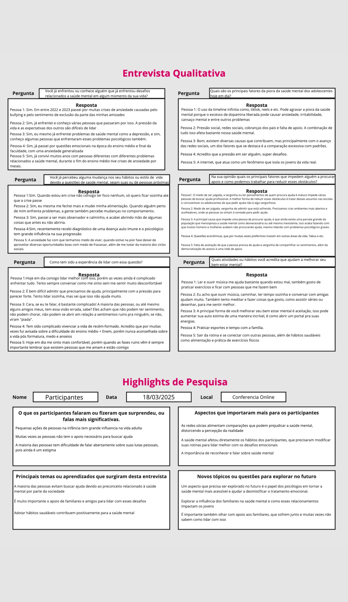**
**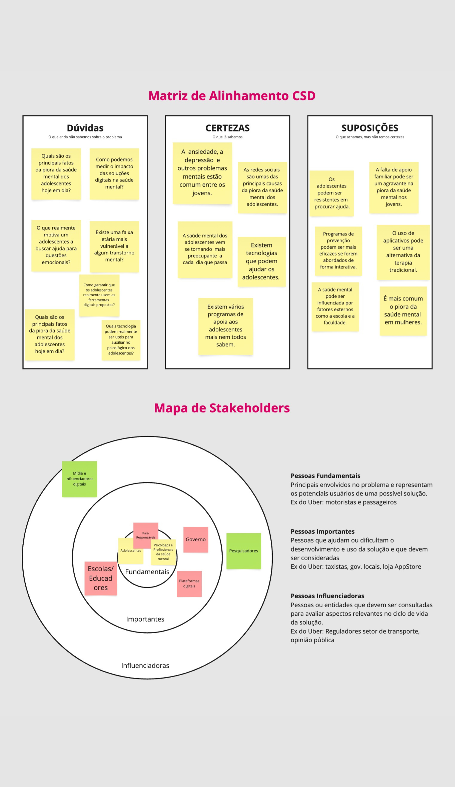**

## Etapa de Definição

### Personas

**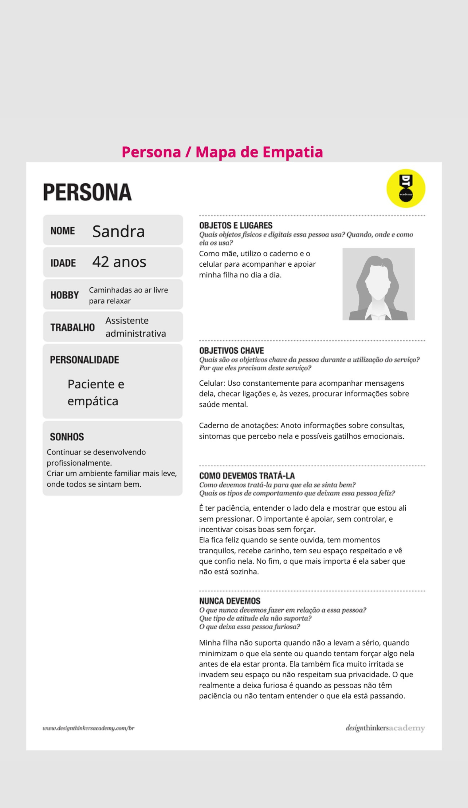**
**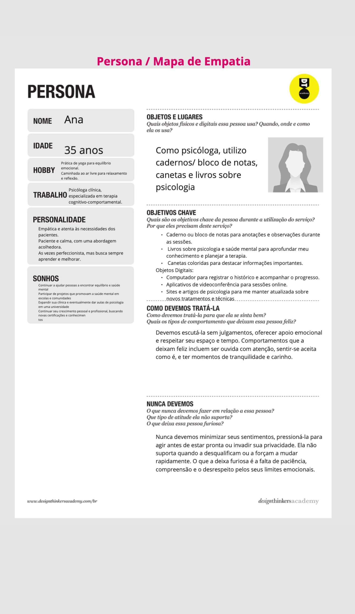**
**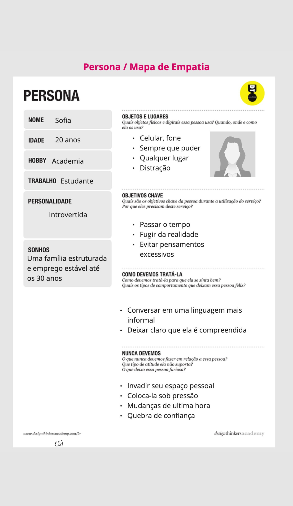**

# Product Design

Nesse momento, vamos transformar os insights e validações obtidos em soluções tangíveis e utilizáveis. Essa fase envolve a definição de uma proposta de valor, detalhando a prioridade de cada ideia e a consequente criação de wireframes, mockups e protótipos de alta fidelidade, que detalham a interface e a experiência do usuário.

## Histórias de Usuários

Com base na análise das personas foram identificadas as seguintes histórias de usuários:

| EU COMO...`PERSONA` | QUERO/PRECISO ...`FUNCIONALIDADE`        | PARA ...`MOTIVO/VALOR`               |
| --------------------- | ------------------------------------------ | -------------------------------------- |
| Ana (Psicóloga) | Uma forma de ajudar meus clientes fora do horário das consultas sem gastar tanto tempo | Conseguir ajudar o máximo de pessoas com o mínimo de tempo |
| Sofia | Um local seguro que me permita entender mais sobre eu mesma |  Entender e conseguir lidar com meus próprios sentimentos |
| Sandra (mãe de uma jovem) | Uma forma que me ajude a entender as emoções e desafios | Oferecer o suporte adequado à minha filha sem invadir sua privacidade e respeitando seu espaço |
| João | Auxílio em momentos difíceis | Lidar melhor com meus problemas |

## Proposta de Valor

**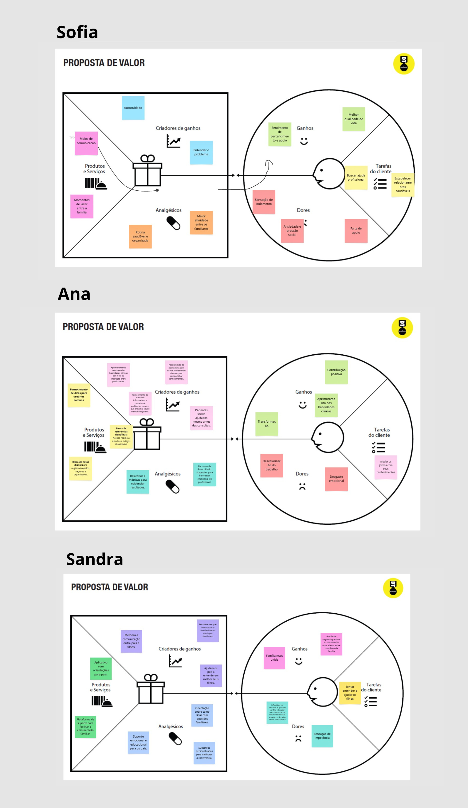**

## Requisitos

As tabelas que se seguem apresentam os requisitos funcionais e não funcionais que detalham o escopo do projeto.

### Requisitos Funcionais

| ID     | Descrição do Requisito                                   | Prioridade |
| ------ | ---------------------------------------------------------- | ---------- |
| RF-001 | Um fórum com possibilidade de abertura de tópicos públicos ou privados | ALTA |
| RF-002 | Identificação de graduados nos fóruns, como um sinal de certificado| BAIXA |
| RF-003 | Fornecer fontes de informações verdadeiras e acessíveis | ALTA |
| RF-004 | Exercícios de meditação| MÉDIA |
| RF-005 | Botões de emergência para indicar quando o usuário está precisando de ajuda imediata | ALTA |
| RF-006 | Informar ao usuário que o auto diagnóstico não é recomendado | MÉDIA |
| RF-007 | Recursos para utilização de profissionais na área | ALTA |
| RF-008 | Agendamento de consultas com psicólogos, com a opção de escolher entre diferentes horários e especializações | ALTA |
| RF-009 | Sugestões simples e não invasivas para melhores questões sobre saúde mental | MÉDIA |
| RF-010 | Botão Emergência | ALTA |
| RF-011 | Uma parte que redireciona para vídeos e podcasts informativos sobre o tema | MÉDIA |
| RF-012 | Sugestões diárias de atividades para melhorar a saúde mental | MÉDIA |

### Requisitos não Funcionais

| ID      | Descrição do Requisito                                                              | Prioridade |
| ------- | ------------------------------------------------------------------------------------- | ---------- |
| RNF-001 | O processo de desenvolvimento deve utilizar HTML e CSS | ALTA |
| RNF-002 | O site deve ser publicado em um ambiente acessível publicamente na Internet (Repl.it, GitHub Pages, Heroku) | ALTA |
| RNF-002 | O site deverá ser responsivo, permitindo a visualização em um celular de forma adequada | ALTA |
| RNF-004 | A aplicação deve ter uma interface para fácil entendimento de todos (desde jovens, a idosos)| ALTA |
| RNF-005 | A plataforma deve ser capaz de suportar grande quantidade de usuários | MÉDIA |
| RNF-006 | Funcionamento off-line | BAIXA |
| RNF-007 | Navegação simples e intuitiva, com menus claros e bem organizados | ALTA |
| RNF-008 | Política de privacidade clara, informando como os dados dos usuários serão utilizados, além de garantir o anonimato, caso o usuário opte por não se identificar | ALTA |
| RNF-009 | Desenvolver o sistema de forma clara para facilitar o manutenção | MÉDIA |
| RNF-010 | compatibilidade com leitores de tela para inclusão de usuários | ALTA |
| RNF-011 | Elementos interativos com destaque visual ao serem selecionados | MÉDIA |
| RNF-012 | Evitar conteúdos piscantes ou intermitentes para prevenir crises em pessoas com epilepsia fotosensível | ALTA |

## Projeto de Interface

Artefatos relacionados com a interface e a interação do usuário na proposta de solução.

### Wireframes

Estes são os protótipos de telas do sistema.

**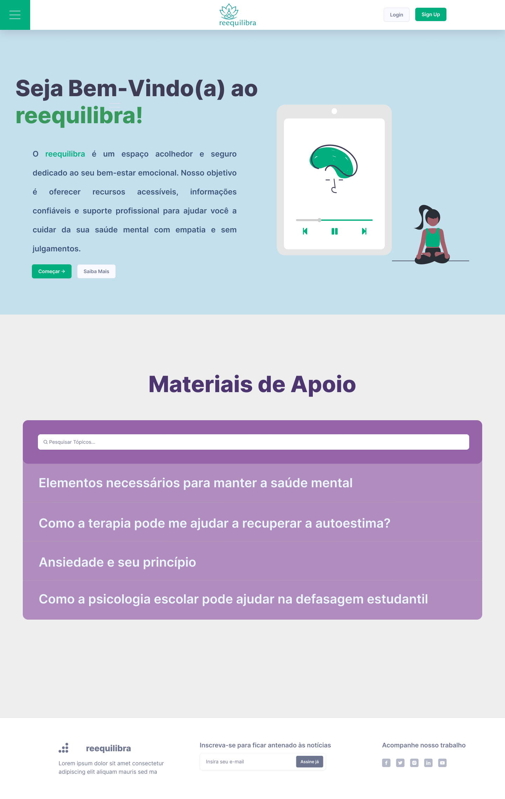**
**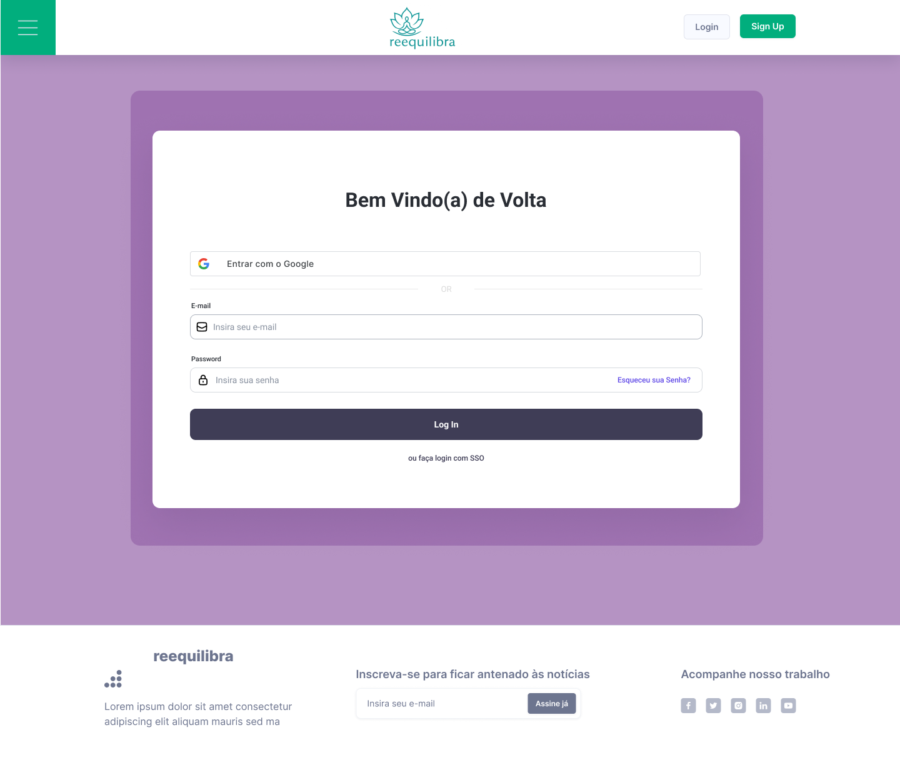**
**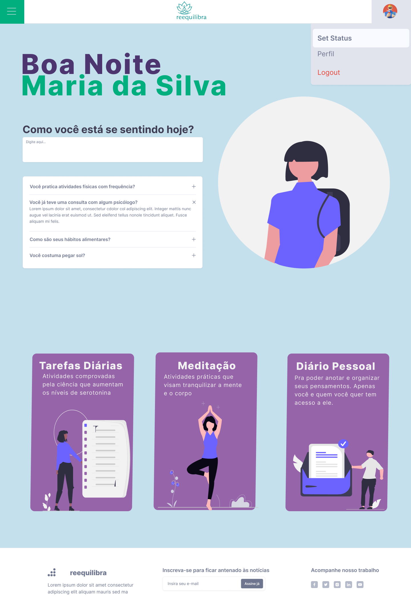**
**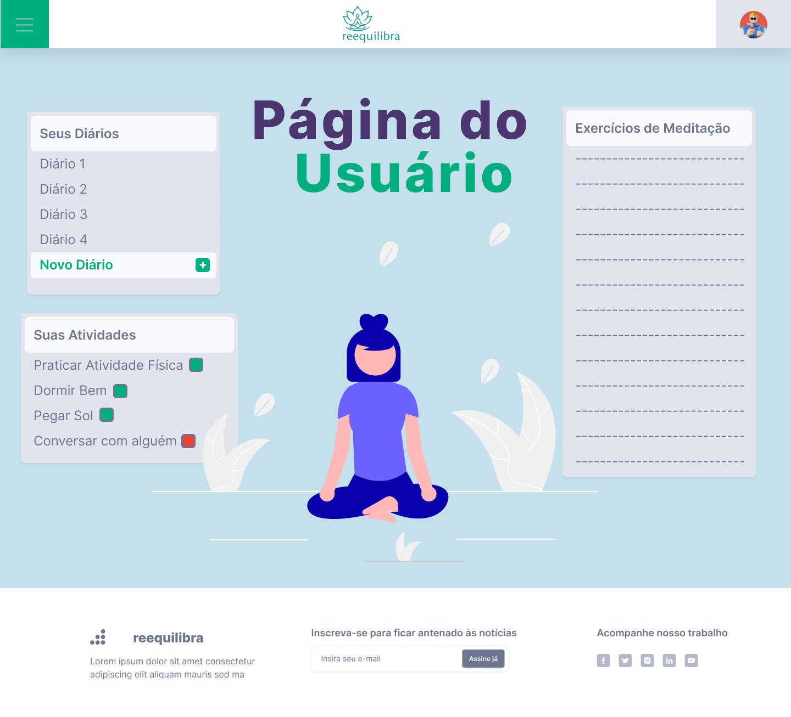**

### User Flow

**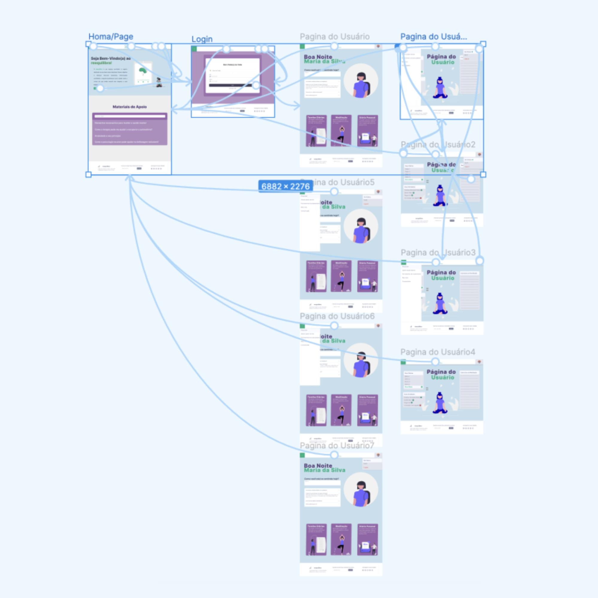**

### Protótipo Interativo

**✳️✳️✳️ COLOQUE AQUI UM IFRAME COM SEU PROTÓTIPO INTERATIVO ✳️✳️✳️**

✅ [Protótipo Interativo (FIGMA)](https://www.figma.com/proto/G1OFrsEnRmn9mlAFH9B7e7/Website-Wireframes-UI-Kit-%7C-BRIX-Agency--Community-?page-id=1202%3A72522&node-id=1255-825&viewport=-4268%2C234%2C0.47&t=vH7rgPFUWWjopKgk-1&scaling=min-zoom&content-scaling=fixed&starting-point-node-id=1255%3A825)

# Metodologia

**Detalhes sobre a organização do grupo e o ferramental empregado.
Editor de código principal: Visual Studio Code.**

## Ferramentas

Relação de ferramentas empregadas pelo grupo durante o projeto.

| Ambiente                    | Plataforma | Link de acesso                                     |
| --------------------------- | ---------- | -------------------------------------------------- |
| Processo de Design Thinking | Miro       | https://miro.com/app/board/uXjVIO1vkVM=/?share_link_id=891421897664 |
| Repositório de código     | GitHub     | https://github.com/ICEI-PUC-Minas-PPLES-TI/plf-es-2025-1-ti1-0385100-reequilibra.git |
| Hospedagem do site          | Render     | NÃO TEM AINDA!! |
| Protótipo Interativo       | FIGMA  | https://www.figma.com/proto/G1OFrsEnRmn9mlAFH9B7e7/Website-Wireframes-UI-Kit-%7C-BRIX-Agency--Community-?page-id=1202%3A72522&node-id=1255-825&viewport=-4268%2C234%2C0.47&t=vH7rgPFUWWjopKgk-1&scaling=min-zoom&content-scaling=fixed&starting-point-node-id=1255%3A825 |
|                             |            |                                                    |

## Gerenciamento do Projeto

Divisão de papéis no grupo e apresentação da estrutura da ferramenta de controle de tarefas (Kanban).

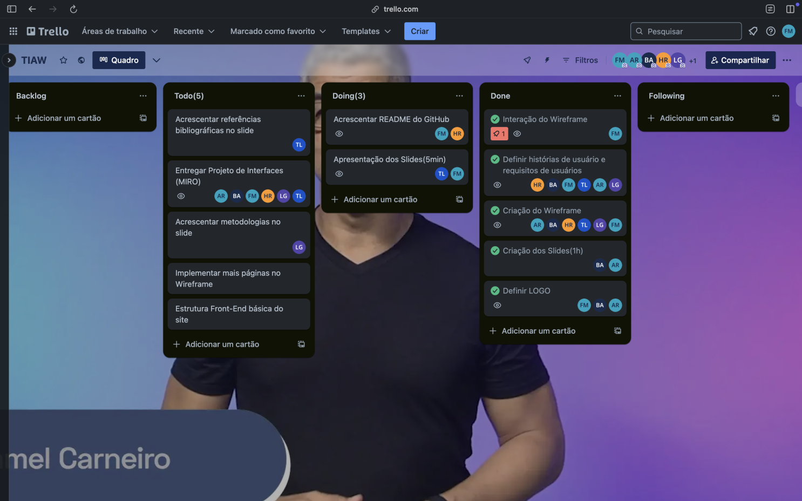

Os integrantes do grupo participaram ativamente, cada um com base em suas funções designadas. A metodologia abordada pelo grupo partiu do estudo das dores dos futuros consumidores e evoluiu em sessões de Brainstorming para discussão de métodos para atenuar essas questões. O grupo se reuniu antes de cada sprint e delegou tarefas individuais e coletivas para cada etapa do processo, tendo como base a metodologia ágil "Scrum".

# Solução Implementada

Atendimento com psicólogos, fórum para suprir um dos principais agravadores de problemas mentais(a falta de liberdade ou orgulho para se comunicar), campanhas de conscientização, atividades diárias para regular os principais hormônios da felicidade (serotonina, dopamina, ocitocina e adrenalina)

## Vídeo do Projeto

O vídeo a seguir traz uma apresentação do problema que a equipe está tratando e a proposta de solução. ⚠️ EXEMPLO ⚠️

## Funcionalidades

##### Funcionalidade 1 - Login
O usuário deve ser capaz de se cadastrar e ver suas tarefas diárias, consultas, etc.

##### Funcionalidade 2 - Agendamento de Consultas
Deve ser adicionada uma aba para agendamento de consultas comprofissionais da área, incluindo desde o pagaento até a interação com uma plataforma de comunicação em tempo real.

##### Funcionalidade 3 - Fórum
Os clientes terão a possibilidade de abrir tópicos sobre questões nas quais sentem dificuldaes e interagir com os psicólogos cadastrados e verificados pela plataforma.

